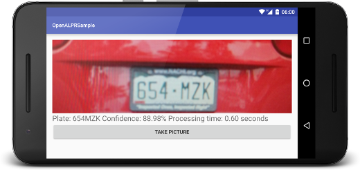
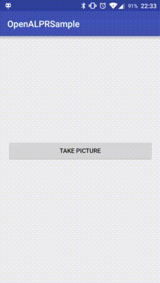

## Disclamer
This project is wrapper of [android-openalpr](https://github.com/SandroMachado/openalpr-android). The reason I developed this project on top of original one is given in "Reason to be Born" section below.

## Description
This library is designed to recogise license plates.

OpenALPR is an open source Automatic License Plate Recognition library written in C++ with bindings in C#, Java, Node.js, and Python. This project ports this library to Android. You can find the demo application `apk` at the [releases](https://github.com/mecoFarid/openalpr/releases) tab.



## Reason to be Born
Original library requires manual implementation which is problematic in some cases. For example original library requires to manually add config file to assets and then edit that file to have a hardcoded path to data direcotry (e.g. `/data/data/com.package.name/....`) of the device. That is the problem because since Android 5.0 there is multiple users support that means they each will have symlink which will make data directory look like `/data/user/0/com.package.name/....` instead of `/data/data/com.package.name/.....`.
Simply that is the reason to wrap the original library to get rid of manual configurations.

## Demo




## Usage

### Integration
[](https://jitpack.io/#mecoFarid/openalpr)

#### Step 1.
Add this in your root build.gradle at the end of repositories:

```
allprojects {
    repositories {
        ...
        maven { url 'https://jitpack.io' }
    }
}
```
#### Step 2.
Add the dependency
```
dependencies {
    ...
    implementation 'com.github.mecoFarid:openalpr:1.0.0'
}
```
### Troubleshooting
If your `targetSdkVersion >= 24` and you're running your app on a device with SDK version 24 and over then you'll get following error:

```
android.os.FileUriExposedException: file:///storage/emulated/0/OpenALPR/2019-09-21-01-32-13.jpg exposed beyond app through ClipData.Item.getUri()
```

#### Solution 1: Easy but Not Recommended
Add following lines in your Activity/Fragment where you interact with OpenALPR.

```
if(Build.VERSION.SDK_INT>=24){
   try{
      Method m = StrictMode.class.getMethod("disableDeathOnFileUriExposure");
      m.invoke(null);
   }catch(Exception e){
      e.printStackTrace();
   }
}
```

#### Solution 2: Recommended
Please follow [this solution](https://stackoverflow.com/q/38200282/5636313) on Stackoverflow to resolve it in a moment.

## Credits

 - [openalpr-android](https://github.com/SandroMachado/openalpr-android) Parent Project
